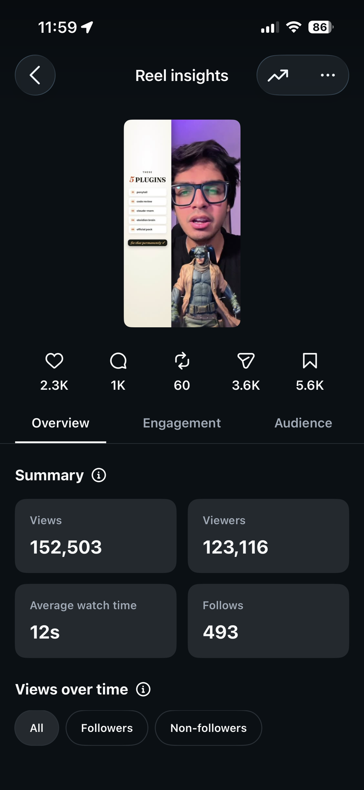
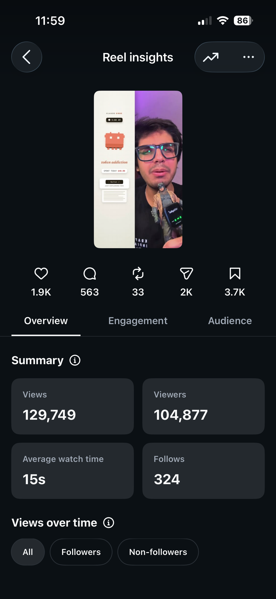
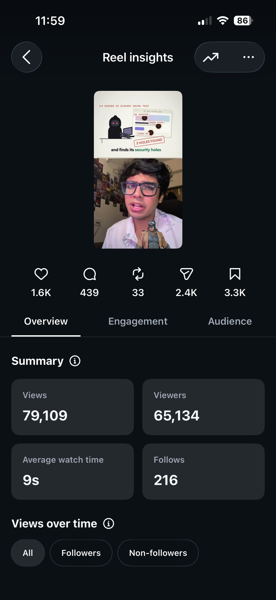
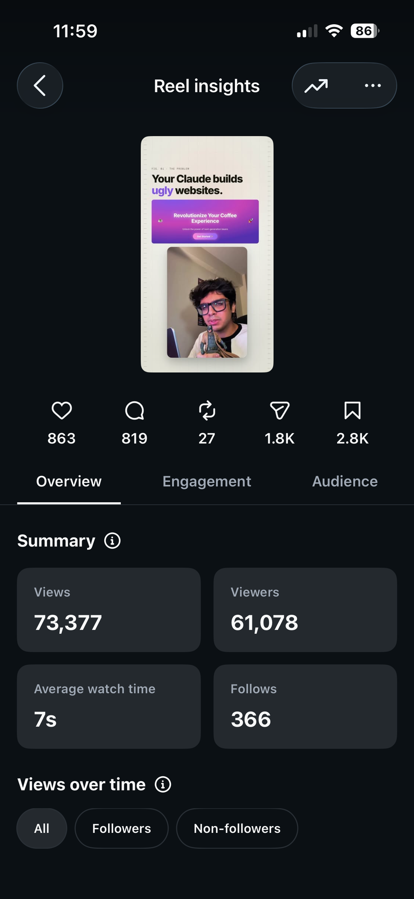

# Reel Factory

**Hand it a raw talking-head take. Get back a finished, posting-ready vertical reel. Change
anything by drawing a box on the frame.**

Not a concept. Four reels built by this system have done **434,738 views, 15.4K saves and 9.8K
sends** on a real creator account. The insight screenshots are below.

**The editor is your terminal. The web app is the intake and review surface.**

```bash
git clone https://github.com/Shreyhac/content-automation
cd content-automation && bash tools/check-env.sh

# 1. The real thing. Open Claude Code in this repo and hand it a take.
#    CLAUDE.md drives it: pipeline, template rules, gates, benchmark, review.

# 2. The web surface: upload, watch, mark up the frame, download.
node web/server.js     # http://localhost:8787
```

Node 18 or newer for the web app. The full pipeline also wants `ffmpeg`, `whisper`,
`playwright` and `swift`, all checked by `tools/check-env.sh`.

**Be clear about which is which.** The web app runs a fast automatic pass: cover-crop to 9:16,
dead air cut, transcription, captions burned clear of the Instagram UI band, loudness normalised.
About 9 seconds for a 20 second clip. That is genuinely their file edited, and it is genuinely
**not** the full system.

The full system is an agent in this repo authoring a bespoke composition per video, running the
pre-render gates, and rendering at 4K. **A real render takes about 40 to 50 minutes.** That is what
produced the four reels linked below. A web request cannot do that, so this repo does not pretend
it can.

| | Cloned web app | Full pipeline, in your terminal |
|---|---|---|
| Time | About 9 seconds for a 20 second clip | **40 to 50 minutes** |
| What you get | 9:16 crop, dead air cut, burned captions, loudness normalised | Bespoke graphics, solved face geometry, safe-zone gates, SFX bed, 4K master |
| Runs on | Node alone | Claude Code plus ffmpeg, whisper, playwright, swift |
| Good for | Seeing the flow end to end in a demo | Producing something you would actually post |

Clone it and the UI does the basic job immediately. Point the agent at the same footage and it
will eat 40 to 50 minutes and hand back a finished reel. Both paths are in this repo. Pick the one
that matches how much time you have.

---

## The problem

A creator records a good 40 second take in five minutes. Making it postable takes **six to eight
hours**: cutting dead air, transcribing and timing captions to the word, building graphics,
keeping text off their own face, honouring Instagram's safe zones, sound design, and then three
rounds of "no, not like that".

So they pick one of three bad options.

| Option | What it costs |
|---|---|
| Edit it themselves | The eight hours. Output collapses to whatever one person can cut. |
| Hire an editor | Money, plus a feedback loop run over voice notes and screenshots. |
| Use a template app | Every reel looks like every other reel, and the template does not know where their chin is. |

The middle one has a failure nobody solves: **video feedback barely survives being written down.**
"The caption thing at the start looks weird" is not actionable. The editor guesses, burns a
render, and guesses again. Rounds three and four are usually the same note, restated.

---

## What this does

**1. It edits.** Word-level transcription, beats taken from the audio envelope rather than from
the transcriber, head geometry measured with Vision, captions cut to word onsets, graphics
composed in HTML and rendered at 4K.

**2. It refuses to ship its own mistakes.** A pre-render gate drives the composition timeline in a
real browser and measures what actually **paints** at every beat: text landing on the face, an
element in the Instagram UI band, two graphics colliding, a beat that is one element over blank
space. Those four defect classes all shipped past conventional linting on real videos, which is
why the gate exists.

**3. Feedback happens on the frame.** Scrub to 0:12, drag a box over the problem, type the note.
Rectangles are stored normalised, so a note left on a laptop lands in the right place on a phone.

**4. It knows when it is wrong.** `tools/qa/benchmark.py` scores a finished file against 13
thresholds, each carrying the specific video and the reaction that set it.

> Run against three already-delivered, client-approved films, **all three failed**. It found banned
> punctuation in 19 delivered caption packs, 9.1 seconds of frozen video inside an approved cut,
> and a place where the written documentation contradicted what the creator actually wanted. That
> is the tool working.

---

## Proof: 434,738 views

Four reels this system produced, posted on a real creator account. Instagram's own insights,
not self-reported numbers.

| Reel | Views | Viewers | Avg watch | Follows | Saves | Sends |
|---|---|---|---|---|---|---|
| [5 plugins](https://www.instagram.com/reel/Db89eZXs4Ys/) | **152,503** | 123,116 | 12s | 493 | 5.6K | 3.6K |
| [Token addiction](https://www.instagram.com/reel/Datc8i5ScQs/) | **129,749** | 104,877 | 15s | 324 | 3.7K | 2.0K |
| [Security holes](https://www.instagram.com/reel/Db1HKFCvoxk/) | **79,109** | 65,134 | 9s | 216 | 3.3K | 2.4K |
| [Ugly websites](https://www.instagram.com/reel/DaoNchQzwII/) | **73,377** | 61,078 | 7s | 366 | 2.8K | 1.8K |
| | **434,738** | | | **1,399** | **15.4K** | **9.8K** |

<p>




</p>

**Saves and sends are the numbers that matter here.** Instagram ranks on sends per reach, and
these reels were saved 15,400 times and sent to another person 9,800 times. 1,399 people followed
the account off four videos.

`reference-cuts/` holds fifteen more finished films as 720p proxies you can watch inside the repo.

---

## Can a cloner get this same quality?

The honest answer, because it is the first thing worth asking about any repo like this.

**Yes, if they run the full pipeline**, and here is what "full" costs. The agent reads
`CLAUDE.md`, picks the template, measures the presenter's head with Vision, authors a composition
for that specific video, runs the gates, renders at 4K, and scores the result against
`tools/qa/benchmarks.json`. That is **40 to 50 minutes** per reel and it needs Claude Code plus
ffmpeg, whisper, playwright and swift.

**What travels perfectly:** the measured geometry, the safe-zone rules, the gates, the caption
engine, the delivery contract, the template systems, and every recorded failure. None of that is
taste. It is arithmetic, and it is all in this repo.

**What does not travel:** the review loop. These reels took three to twelve rounds each against a
real person's reactions. A first render is a draft here, always. `docs/09-self-review.md` exists
to substitute for rounds one and two by making the agent run the creator's own review on itself
before delivering, and it closes most of the gap. It does not close all of it.

So: a cloner gets the system, the standard, and the tooling that enforces it. What they build
their own version of is the taste loop, and the repo tells them exactly how.

---

## What it can pull in

A reel is rarely just the talking head. The system sources and rebuilds the supporting material:

| Source | How, and how far it is trusted |
|---|---|
| **Stock footage (Pexels)** | `tools/stock/pexels_search.py` and `pexels_fetch.py`. The default b-roll source. A midframe is extracted from every candidate and looked at: the reject rate is about one in three even on a hand-picked shortlist. |
| **YouTube** | Via `yt-dlp`, for auditioning b-roll before committing to it. |
| **Pinterest** | Evaluated and working through its unauthenticated API and HLS streams, then deliberately **not** made the default: it caps at 720p and much of it is unlicensed re-uploads. `playbooks/stock-footage.md` carries the finding. Included because knowing why a source was rejected is worth as much as the sources that were kept. |
| **Social posts (X and similar)** | Not screenshotted. The post is **rebuilt as native HTML** at reel type sizes, keeping the real handle, avatar and chrome for trust while making the body legible at 1080 wide. A screenshot scaled into a card reads as vague; a rebuilt card is sharp. |
| **Live product and repo pages** | Captured headless with Playwright at 2x, and every claim about a repo or product is verified against its API or source before it appears on screen. A reference video showing a product's UI is not evidence that the UI exists. |
| **Generated assets** | `tools/generative/` covers cloned voice, AI plates, image-to-video, and licensed music. Drift on a generated clip is measured per face and per hand, not globally, because a global metric read 4.84 while a hand drifted 77.4. |

---

## Try it in 60 seconds

1. `node web/server.js`, open `http://localhost:8787`, click **Open the app**.
2. **Access:** click **Skip, use demo account**. Or paste an Anthropic or OpenAI key: it is
   shape-checked in the browser and never leaves it.
3. **Source:** drop in any video file.
4. **Build:** watch the pipeline, about 40 seconds.
5. **Review:** pause, drag a red box over anything, type a note. Click a note to seek back.
6. **Delivery:** download the MP4.

### What is real and what is staged

Stated up front rather than buried, because it is the first thing worth asking.

**Real:** the upload, the review canvas, notes (stored, listed, seekable, deletable), the
download, the HTTP range requests that make scrubbing work, and the reel itself, which is a real
shipped and approved film.

**Staged:** the 40 seconds between upload and result runs on a timer instead of invoking the
renderer. The stage names are the real pipeline steps, but a genuine 4K render takes 10 to 25
minutes and has hard-reset an 8GB machine. That does not fit a demo slot, and pretending otherwise
would be the actual dishonesty.

The real pipeline is the rest of this repository. It is not a mock, it just is not a web request.

---

## Layout

```
web/                 The product. server.js uses Node built-ins only, zero dependencies.
templates/           Four editing systems, each with its rules, measured geometry and the
                     history of what every review round changed.
tools/
  gates/             guard.py, the pre-render gate. derive_config.py bootstraps its config.
  qa/                benchmark.py, the measured bar. Contact sheets, frame extraction.
  vision/            Head measurement: crown from segmentation, chin from face contour.
  review/            The same on-frame review loop as a CLI, used in real production.
  aroll/ captions/   Cutting, transcription, caption assembly.
  sfx/ chunking/     Sound beds, long-form chunked rendering.
  generative/        Voice cloning, AI plates, drift measurement, licensed music.
docs/                The method, in eight numbered stages, plus a self-review protocol.
playbooks/           One file per technique. Every rule carries the failure that produced it.
reference-builds/    Eight shipped compositions, code only.
reference-cuts/      Fifteen 720p proxies of finished films. The bar, watchable.
```

---

## Engineering notes

- **The gate refuses to run on an unfinished config.** Some values cannot be derived from a
  composition, such as which rectangle the graphics are supposed to own. `derive_config.py`
  bootstraps everything derivable and marks the rest `TODO`; the gate then exits rather than
  running half-blind. A gate reporting PASS without having measured anything is worse than no gate.
- **A coverage check that could never fail.** The blank-space check summed overlapping rectangles,
  so a full-frame video measured 212% covered and the floor was mathematically unreachable. It now
  computes true union area, and the same film measures 100%.
- **Notes survive resizing** because rectangles are normalised at write time, not at read time.
- **Range requests are implemented properly**, 206 and 416 both. Without them the scrubber cannot
  seek, and the review step is the entire product.
- **Storage degrades safely.** Local JSON by default, optional Supabase mirror
  (`web/config.example.json`, `web/schema.sql`). The mirror is deliberately fire-and-forget so a
  slow network cannot blank a live demo.

---

## Status

A working prototype built on top of a production system that predates it and has shipped **67
reels across 4 template systems**. The payment tiers on the final screen are mocked and labelled
as such. Every state has been driven end to end in a headless browser with zero page errors, at
1440px and at 390px.

The editing rules here were not invented for a demo. Each one is the residue of a real video being
rejected and re-cut.
